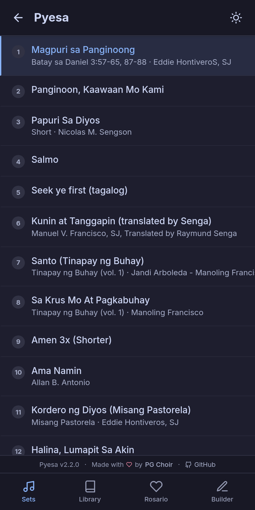
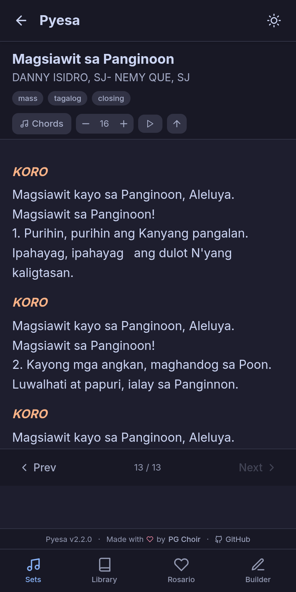
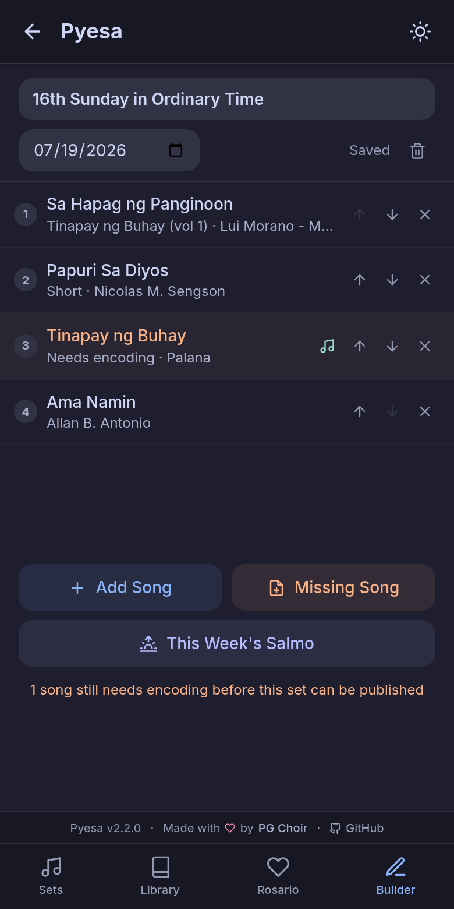
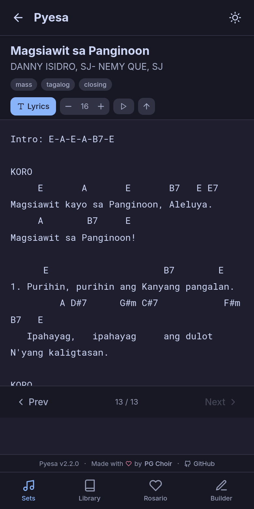
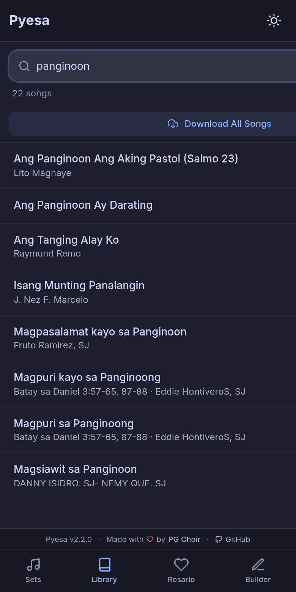
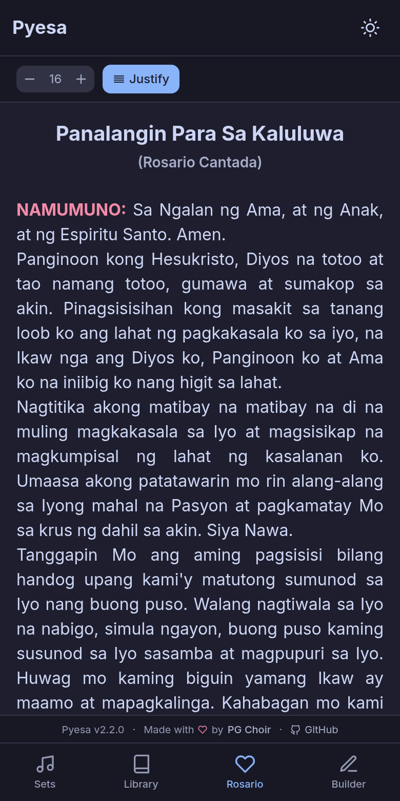
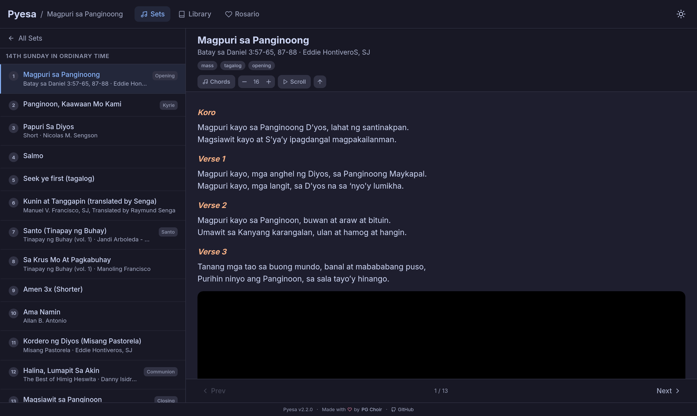
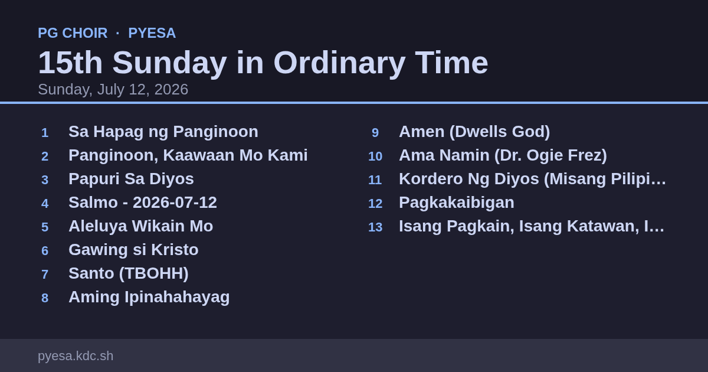
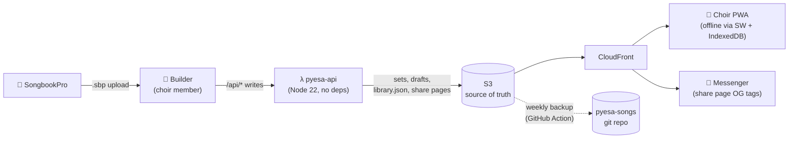

# Pyesa 🎶

**The choir companion for mass.** Weekly song sets, a searchable ChordPro song library, the Rosario Kantada, and a collaborative set builder — offline-capable, installable, and built for phones.

Made with ♥ by [PG Choir](https://www.facebook.com/PGChoir) · Live at [pyesa.kdc.sh](https://pyesa.kdc.sh)

<p align="center">
  
  
  
</p>

## Features

**For the choir**

- **Sets** — weekly mass song sets by date; auto-selects the current week, swipe between songs.
- **Song viewer** — ChordPro rendering with lyrics-only or chords mode, adjustable font size, and auto-scroll for hands-free singing.
- **Library** — every song, searchable by name, author, subtitle, or lyrics; seeded automatically on any device.
- **Rosario Kantada** — the full prayer with interactive **(AWIT)** markers that open a song picker.
- **Offline & installable** — a PWA with everything pre-cached; works with zero signal inside the church.

**For whoever builds the set** (passcode-protected `/builder`)

- Build next week's set from a phone: search, preview, and add songs in order.
- **Placeholders** for songs not yet encoded — the set itself becomes the to-do list, and uploading a SongbookPro `.sbp` export resolves them automatically.
- **This Week's Salmo** — type the two lines of the psalm response; the usual chords are applied automatically.
- Names suggest themselves from the liturgical calendar (pick July 19, get *16th Sunday in Ordinary Time*).
- **Publish** makes the set live instantly and creates a share page whose Messenger preview shows the full song list as an image. Published sets can be reopened, edited, and republished.

<p align="center">
  
  
  
</p>

**Desktop** gets a split view:

<p align="center">
  
</p>

**Messenger share card**, generated at publish time:

<p align="center">
  
</p>

## The weekly workflow

1. A choir member opens **`/builder`** on their phone (passcode required once per device) and builds the upcoming Sunday's set — adding **placeholders** for songs that aren't in the library yet.
2. The maintainer encodes the missing songs in SongbookPro, exports them as a `.sbp`, and uploads it in the Builder. New songs join the library and matching placeholders resolve automatically.
3. When no placeholders remain, **Publish Set** writes the set live to the app, regenerates the manifests, and creates the share page — paste the link in the choir's Messenger group and the whole song list shows as a card.
4. The maintainer rebuilds the set inside SongbookPro by picking the songs. (Never *import* a set back into SongbookPro — its importer always duplicates songs. `.sbp` files flow one direction only: SongbookPro → Pyesa.)

## Architecture



- **Frontend:** React 18, React Router 7, Tailwind CSS 4 (Catppuccin-inspired), chordsheetjs, IndexedDB via `idb`, vite-plugin-pwa/Workbox.
- **Backend:** a single dependency-free Node 22 Lambda (`server/`) behind a CloudFront `/api/*` behavior — drafts CRUD, `.sbp` parsing (hand-rolled zip reader), publishing, share pages. All writes require the `x-pyesa-key` passcode.
- **Data:** S3 is the source of truth for `files/` (sets, `library.json`, drafts); the [pyesa-songs](https://github.com/ianpogi5/pyesa-songs) repo is a backup, refreshed weekly by the `backup-songs` workflow.
- **Infra:** Terraform (`infra/`) — S3, CloudFront, Lambda + Function URL.

## Development

```bash
git clone git@github.com:ianpogi5/pyesa.git
cd pyesa
npm install
npm run dev        # http://localhost:5173 — /api proxies to production (override: PYESA_API_ORIGIN)
```

```bash
npm run lint       # eslint src/ server/ scripts/
npm run test-api   # API smoke tests (in-memory store; uses sample.sbp in repo root if present)
npm run build      # production build (regenerates sets.json, library.json, liturgy.json)
npm run preview    # serve the production build locally
```

### Project structure

```
public/
  files/               # Song data (separate private git repo; S3 is source of truth)
    mass/              #   Song set JSON files (YYYY-MM-DD - Name.json)
    drafts/            #   Set-builder drafts (written by the API)
    sets.json          #   Auto-generated manifest of all sets
    library.json       #   Canonical deduped song library
    rosario-set.json   #   Suggested songs for Rosario AWIT markers
  liturgy.json         # Generated: date → liturgical day name (build-time romcal)
scripts/
  generate-manifest.js # sets.json from mass/
  generate-library.js  # merges mass/ songs into library.json
  generate-liturgy.js  # liturgy.json for set-name suggestions
  upload-song.sh       # local song changes → S3 (+ git push)
  sync-down.sh         # ad-hoc S3 → songs repo backup
server/                # API Lambda (router, .sbp parser, share pages, S3 store)
src/                   # React app (pages, components, IndexedDB layer)
infra/                 # Terraform (S3, CloudFront, Lambda)
```

## Deployment

Releases deploy from **Actions → Release & Deploy**: enter a semver version and the workflow bumps `package.json`, generates the changelog from [conventional commits](https://www.conventionalcommits.org/), creates the GitHub release, applies Terraform, uploads the build to S3 (immutable hashed assets, `no-cache` for `sw.js`/`index.html`), and invalidates CloudFront.

Song data is backed up to the songs repo every Monday (PH time) by **Actions → Backup Songs to Git**, which can also be run manually.

### Required GitHub secrets & variables

**Secrets** (environment: Production):

| Secret                  | Description                                                       |
| ----------------------- | ----------------------------------------------------------------- |
| `AWS_ACCESS_KEY_ID`     | AWS IAM access key                                                |
| `AWS_SECRET_ACCESS_KEY` | AWS IAM secret key                                                |
| `API_PASSCODE`          | Shared passcode for the set-builder API                           |
| `SONGS_DEPLOY_KEY`      | SSH deploy key (write) on pyesa-songs for the weekly song backup  |

**Variables** (environment: Production):

| Variable         | Description                        |
| ---------------- | ---------------------------------- |
| `S3_BUCKET`      | S3 bucket name (e.g. `pyesa-web`)  |
| `AWS_REGION`     | AWS region (e.g. `ap-southeast-1`) |
| `AWS_ACCOUNT_ID` | AWS account ID                     |
| `AWS_USER`       | AWS IAM user name                  |
| `SSL_CERT_ARN`   | ACM certificate ARN for the domain |
| `DOMAIN`         | Domain name (e.g. `pyesa.kdc.sh`)  |
| `API_DOMAIN`     | Unused (legacy)                    |

## License

Private project.
